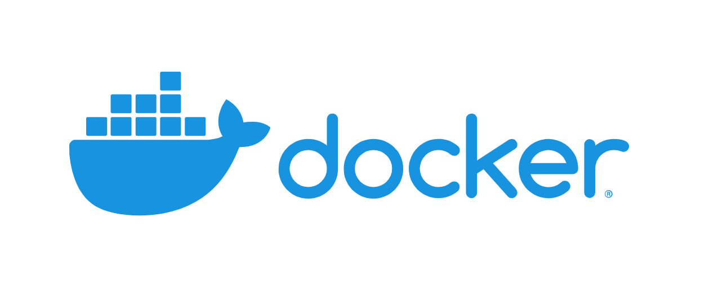

# Devops Solution Package for Application Server Orchestration

최근 개발 효율을 늘리기 위해 기업들이 소프트웨어 개발 방법론 중 하나인 [Devops](https://aws.amazon.com/ko/devops/what-is-devops/) 이용 사례가 빈번하게 늘고 있는데 여러가지 보조 Tools이 많은데 이를 각각 Settings & Management를 해야 하기에 기업에서는 아예 별도로 Devops Engineer 까지 구인을 하고 있다. 이를 한번에 묶어서 Setting 하고 한눈에 Monitoring 할 수 있는 Solution 의 Package 형태로 배포하고 Service 를 제공할 수 있다.

-   유사 사례 [Centralized logging under Kubernetes - Banzai Cloud](https://banzaicloud.com/blog/k8s-logging/)

##  구성도

## Require Techiniques

-   docker
   
    -   Virtualization 을 이용하여 Application 및 Service를 Container 화 하여 Module 단위로 구성

-   kubernetes(k8s)
   
    -   docker를 통해 Container화 된 Module들을 Control하기 위해 필요

-   traefik
   
    -   각 docker의 상호 Communication과 외부 Connections를 위해 필요

-   elasticsearch
    
    -   Logging 과 Metric 확인을 위해 각 Data들을 저장하고 가공하여 제공하기 위한 검색엔진 기반 Database

-   Kibana
   
    -   elasticsearch 에서 가공된 Data를 Visualization 하여 제공하고 ML을 통한 추가 Data 가공을 지시하기 위한 Terminal 역할

-   fluentd & fluentdbeat
    -   

##  docker & kubernetes(k8s) 선택 이유
-   docker를 이용해 서비스를 구축하게 되면 손쉽게 생성/삭제가 가능하고 image를 통해 고객이 원하는 커스텀을 저장하고 배포까지 가능하여 최적의 선택이라고 판단했습니다. 
-   여기에 kubernetes(이하 k8s)를 이용하게 되면 docker를 분산처리하며 추후에 특정 고객이 급하게 서버 증설을 요청을 하여도 클러스터링을 통해 능동적으로 조정할 수 있습니다. 
-   그리고 서비스 디스커버리 기능이 있어 많은 구동중인 서비스를 관리하는데 효과적으로 이용할 수 있습니다. 
-   또한 로깅과 모니터링 역시 한곳에서 관리하도록 설정할 수 있어 문제 발생시 신속하게 파악/조치가 가능합니다.
