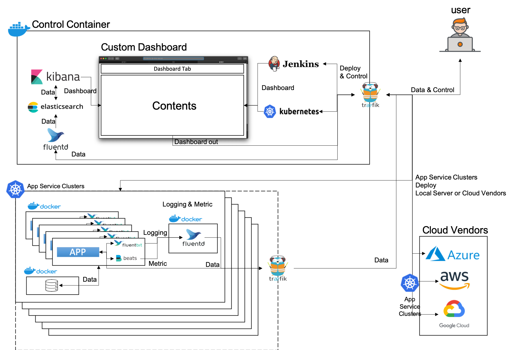

# Service Server Orchestration with kubernetes(k8s)

##  teammate
-   김수혁, 김한상, 정지윤

##  개요
docker와 kubernetes(k8s), elastic stack을 이용하여 고객이 요청한 서비스를 자동화를 통해 구성하고 제공합니다.

##  구성도

##  docker & kubernetes(k8s) 선택 이유
-   docker를 이용해 서비스를 구축하게 되면 손쉽게 생성/삭제가 가능하고 image를 통해 고객이 원하는 커스텀을 저장하고 배포까지 가능하여 최적의 선택이라고 판단했습니다. 
-   여기에 kubernetes(이하 k8s)를 이용하게 되면 docker를 분산처리하며 추후에 특정 고객이 급하게 서버 증설을 요청을 하여도 클러스터링을 통해 능동적으로 조정할 수 있습니다. 
-   그리고 서비스 디스커버리 기능이 있어 많은 구동중인 서비스를 관리하는데 효과적으로 이용할 수 있습니다. 
-   또한 로깅과 모니터링 역시 한곳에서 관리하도록 설정할 수 있어 문제 발생시 신속하게 파악/조치가 가능합니다.
