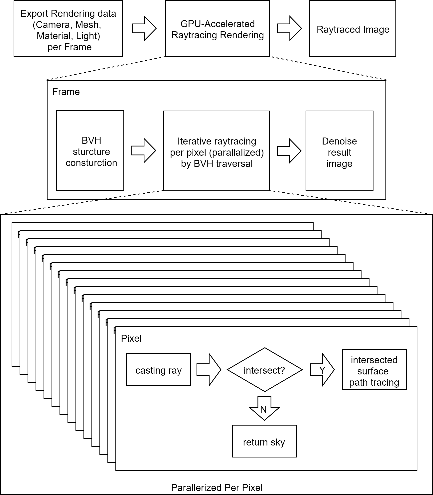
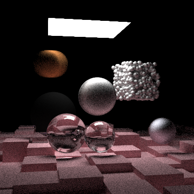

# GPU-Accelerated Raytracing Renderer for Unity(Plugin)

real-time rendering framework / game engine 에서 씬 렌더링 데이터를(Camera, Mesh, Material, Light) 가져와 해당 씬을  GPGPU(CUDA/OpenCL) 혹은 GPU의 driver API(DirectX/HLSL) 를 사용하여 raytracing 기법으로 photorealistic image 를 만듦. 

# 활용 방안

  1. real-time rendering 의 결과인 synthesized image 와 비교하여 reference image 로써 사용되거나,([Octane Renderer at Unity](https://www.youtube.com/watch?v=k0U_-9Mjuxw&feature=youtu.be&t=120))
  2. 연속적으로 이미지를 생성하여 video 로 결과를 만들어 낼 수 있음. ([UE4: Reflection Real-Time Ray Tracing Demo](https://www.youtube.com/watch?v=J3ue35ago3Y)) 흔히 사용되는 GPGPU 렌더러의 역할을 함.

# 개략적인 구조도

# 데모

# 팀 구성

김수혁, 김한상, 정지윤

# Require Techiniques

기술은 Octane Render 의 방법을 모방.(CUDA, Metropolis Light Transport)

  - Raytracing 
    - 각종 알고리즘에 대한 학습, 구현. 
      - 학습 : acceleration structure : BVH
      - 학습 : metropolis light transport(진행 중)
      - 구현 : metropolis light transport -> CPU(C/C++)
      - 구현 : metropolis light transport -> GPU(CUDA)
  - CUDA(GPGPU-Optimization)
    - 기본적인 programming interface 에 대한 구조와 일반적인 optimizaton 전략에 대해서는 파악했으나 global memory fetch 가 잦기 때문에 이에 걸맞는 성능 향상 방안 필요.
      - traversal optimization
    - cuda stream, graph 학습
  - Unity : rendering data-transfer 에 대한 구체적인 방법이 필요함. 현재는(190918) 위 구조도의 형태로 데이터를 가져올 예정.
    - 프로세스를 분리할 것인가? 자식 형태로 구성할 것인가?

  - 진척된 상황
    - raytracing 기본 원리 및 CPU 기반 구현
    - CUDA 를 이용한 raytracing 구현
    - 학습 : MCMC, metropolis-hastings algorithm
    - 구현 : iterative stochastic raytracing -> CPU
    - 구현 : iterative stochastic raytracing -> GPGPU(CUDA)
  