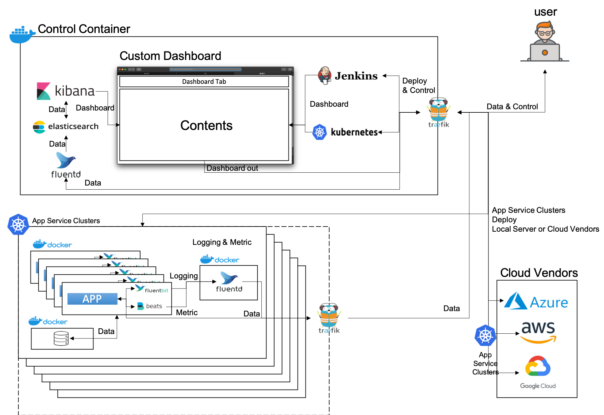

# Devops Solution Package for Application Server Orchestration

최근 개발 효율을 늘리기 위해 기업들이 소프트웨어 개발 방법론 중 하나인 [Devops](https://aws.amazon.com/ko/devops/what-is-devops/) 이용 사례가 빈번하게 늘고 있는데 여러가지 보조 Tools이 많은데 이를 각각 Settings & Management를 해야 하기에 기업에서는 아예 별도로 [Devops Engineer](http://www.thisisgame.com/webzine/news/nboard/4/?n=71605) 까지 구인을 하고 있다. 이를 한번에 묶어서 Setting 하고 한눈에 Monitoring 할 수 있는 Solution 의 Package 형태로 배포하고 Service 를 제공할 수 있다.

-   유사 사례 [Centralized logging under Kubernetes - Banzai Cloud](https://banzaicloud.com/blog/k8s-logging/)

##  구성도

## Require Techiniques

-   docker 
   
    -   Virtualization 을 이용하여 Application 및 Service를 Container 화 하여 Module 단위로 구성

-   kubernetes(k8s) 
   
    -   docker를 통해 Container화 된 Module들을 Control하기 위해 필요

-   traefik 
   
    -   각 docker의 상호 Communication과 외부 Connections를 위해 필요

-   elasticsearch 
    
    -   Logging 과 Metric 확인을 위해 각 Data들을 저장하고 가공하여 제공하기 위한 검색엔진 기반 Database

-   Kibana 
   
    -  [kibana demo](https://demo.elastic.co/app/monitoring)
    -   elasticsearch 에서 가공된 Data를 Visualization 하여 제공하고 ML을 통한 추가 Data 가공을 지시하기 위한 Terminal 역할

-   fluentd & fluentdbeat 
     
    -   각 Container의 log를 포함, 이 Package안에 모든 시스템의 log를 수집하기 위한 pipeline 역할

-   metricbeat & beats 
    
    -  각 Container의 Metric상태, 혹은 Network Traffic등 Monitoring에 필요한 여러 자원들의 정보를 수집하는 pipeline 역할

-   jenkins 
   
    -   CI(Continuous Intergration) Tool 로써 Source Code Repository 에 대한 지속적인 통합과 지속적인 전달 환경을 구축하기 위해 사용

-   cloud service vendors 
      
    -   Local Service 뿐만 아니라 Cloud Service vendor를 통한 App Service 에 대해서도 대응

